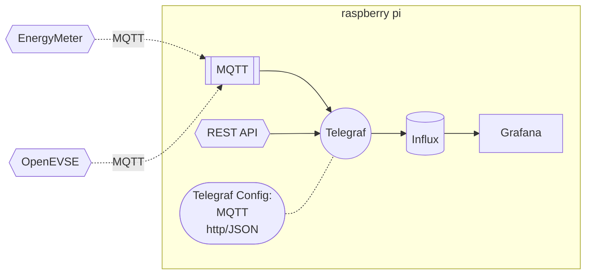

# Ansible PI
This ansible playbook helps me setup Raspberry Pi which I am using for capturing multiple metrics: 
* home energy consumption 
* EV charger 
* metrics from Polish electrical grid operator

Automation sets up following components: 
1. [Docker](https://www.docker.com/)
2. [Mosquitto (MQTT server)](https://mosquitto.org/)
3. [InfluxDB](https://www.influxdata.com/)
4. [Telegraf](https://www.influxdata.com/time-series-platform/telegraf/)
5. [Grafana](https://grafana.com/)

Data pipeline is setup automatically (up to InfluxDB), but Grafana requires manual setup.  
All components are run using single docker-compose and are setup for automatic restart. 

## DataFlow


# Configuration

## Host configuration

Initial Versions (run on Ubuntu 20.04)
* ansible 2.9.6
* python 3.8.10

Current version (run on MacOS Ventura 13.0.1)
* ansible 2.13.6
* python 3.11.0

### sshpass installation 
You will need *sshpass* installed on your host machine.  

Ubuntu:
```
sudo apt-get install sshpass
```
MacOS:
```
brew install hudochenkov/sshpass/sshpass
```

## Raspberry Pi setup
I am using Raspberry Pi OS Lite. 
Currently tested release: 22.09.2022 (2022-09-22-raspios-bullseye-armhf-lite.img)  
System will automatically install docker and docker-compose. Here are tested versions:
```
Docker version 20.10.5+dfsg1, build 55c4c88
docker-compose version 1.25.0, build unknown
```

### Issue with docker-compose
Newer versions of docker-compose installed from PIP have [issues with building correctly cryptography package](https://github.com/pyca/cryptography/issues/5771#issuecomment-775176581).  
I've switched to older docker-compose version from RaspiOS `apt-get` package. 

## Initial setup 
Please adjust configuration files for your needs: 
* Configure WiFi network and password in [wpa_supplicant.conf](sdcard/wpa_supplicant.conf)
* Set your Raspberry Pi IP address in inventory [raspberries](raspberries)

# Installation process 

## Prepare SD card

1. Burn image (MacOS version, you can also use [Raspberry Pi Imager](https://www.raspberrypi.com/software/))

  * Find your SD card (later I will use **diskN**)
    ```
    diskutil list
    ```
  * unmount any mounted partitions of SD card
    ```
    diskutil unmountDisk diskN
    ```
  * write image using **dd** command
    ```
    sudo dd bs=1M if=raspberrypi_image.img  of=/dev/diskN status=progress
    ```


2. Copy configuration files from `sdcard` into sd card's `/boot` directory  
    
    **Please configure WiFi network and password in wpa_supplicant.conf file first!** 

    | File     | Description     |
    | ------------- | ------------- |
    | ssh        | Empty file. It enables SSH console |
    | userconf.txt | Defines user and it's password. Setup to default `pi:raspberry`. Use `openssl passwd -6` for generating other password |
    | wpa_supplicant.conf | Defines WiFi connection. Use `wpa_passphrase` for generating encrypted password|

    You can find more documentation
    [Setting up a headless raspberry pi](https://www.raspberrypi.com/documentation/computers/configuration.html#setting-up-a-headless-raspberry-pi)

3. Put a card into RaspberryPi and wait for magic to happen. RaspiOS will install the system creating a default user
  User: pi
  Password: raspberry
    > password can be modified simply by changing the content of userconf.txt file.  
    Modification of user name would require changing of multiple playbook files.

3. **Additional steps are required**
    > Addtional steps are required because of rfkill issue (See  [enable_wifi.bash](https://gist.github.com/jrconlin/0b79fbfcba3d5ec91751cb1a667b410e)).  
    Root cause is related to race condition between setting up of country and setting up of Wifi network based on `wpa_supplicant.conf` file.  
    Manual setup of country is a known workaround for  Those additional steps requires keyboard and screen.   

*  Manual setup of country using **raspi-config**
    ```
    sudo raspi-config nonint do_wifi_country GB
    ```


## Run ansible  playbook ("all in one" installation)
```
ansible-playbook rpisetup.yml --tags="allinone"  -i raspberries --ask-pass -c ssh
```

## Setup grafana
Grafana's setup is not automated.  
After containers are up and running you should be able to open grafana
```
Grafana
  IP:  http://192.168.68.100:3000/
  User: admin
  Psw: admin
```
In Grafana: select data source and setup connection to InfluxDB
```
Data source: InfluxDB
URL:  http://influxdb:8086
Database: telegraf
User: telegraf_user
Psw: telegraf_password
```

# Ansible 

## Ansible playbook structure 

You can also run step by step installation process.
Use tags in the following order: 
1. update
1. dockerinstall
1. dppdirectories
1. mqtt
1. telegraf
1. dockerrun

## Ansible playbook TODOs
- [ ] Add description about using Ansible vault or headless installation of ssh keys
- [ ] Check possibility to run newer docker-compose

# Useful hints and links 

Add ssh fingerprint
```
ssh-keyscan -H 192.168.68.100 >> ~/.ssh/known_hosts
```

## Inspirations and links for a better readme
* [Nice readme (Home Assistant configuration)](https://github.com/CCOSTAN/Home-AssistantConfig#readme)  
* [Markdown basic](https://www.markdownguide.org/basic-syntax/)  
* [Markdown extended](https://www.markdownguide.org/extended-syntax)  
* [GitHub Flavored Markdown Spec](https://github.github.com/gfm/)  
* [Examples of mermaid graphs]( https://mermaid.js.org/syntax/flowchart.html)


